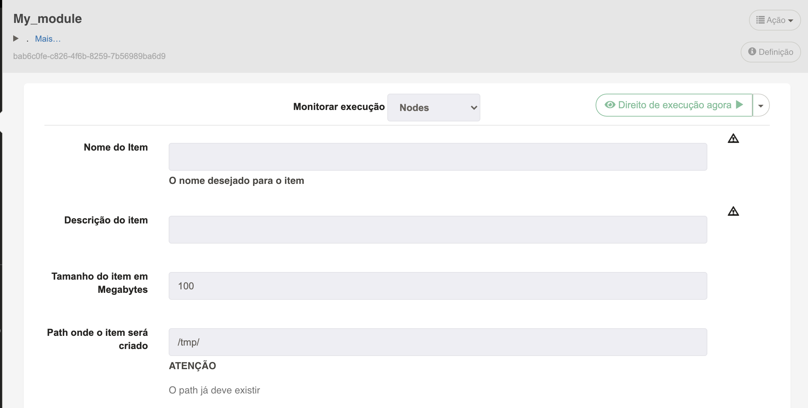
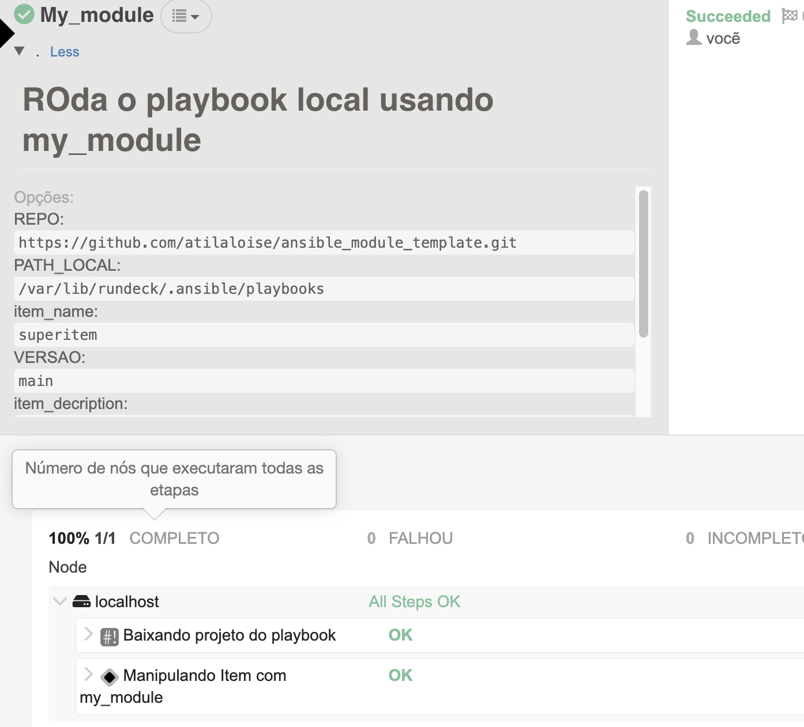

# Trilha DevOps com Python até o SRE

# 🚀 Profissionais de alto desempenho

Estamos em uma fase do mundo tecnológico onde a alta performance é algo que se exige não só de equipamentos, programas ou ferramentas. O mercado exige profissionais de alto desempenho.

Pois bem, na prática o que isso quer dizer?

Simples, você precisa entregar mais do que geralmente 3 ou 4 pessoas entregariam, em menos tempo, e claro, com menos esforço.

Bom, não se iluda. O esforço é enorme principalmente no começo. Mas eu de garanto que você vai ser capaz de, em um único esforço (que tende a diminuir a cada nova experiência) entregar soluções que podem escalar de acordo com a demanda do seu local de trabalho.

Nessa jornada vamos falar de 3 ferramentas básicas. Python, Ansible e Rundeck. 

Claro que nosso pack de ferramentas pode ser muito maior que isso. Shell Script, Golang, Powershell, puppet, Salt e muitas outras linguagens e ferramentas são grandes aliadas no processo de evolução.

Pelo seu bem e pelo bem da empresa onde você trabalha, não se limite a ferramenta x ou y, muito menos insista em reinventar a roda. Pesquise por ferramentas que te ajudem a solucionar problemas específicos com menos esforço. Estude muito e trabalhe de forma inteligente, essa é a combinação imbatível.

# 📜 Automação é a lei

Se tem uma coisa que um profissional de alto desempenho detesta, é trabalho repetitivo. Vejo muitos caras de altíssimo nível, extremamente infelizes com sua rotina de trabalho, onde suas capacidades excepcionais de raciocínio e resolução de problemas são deixadas de lado para fazer volume na execução de procedimentos padronizados(ou não) que objetivam uma satisfação a curtíssimo prazo.

E assim segue a vida... Os mesmos problemas, e o loop frustrante da recorrência.

Afinal, se é repetitivo, é automatizável. Agrega-se muito mais valor organizando esse fluxo e quebrando cabeça para aprender e utilizar ferramentas que façam a parte repetitiva por mim, aliás, por todos.

É disso que se trata tudo isso que falamos de SRE, DevOps, DataOPs, e tudoOps mais que vai surgindo a cada dia que passa. Se eu tenho que executar um trabalho, com os mesmos passos e as mesmas variáveis, então temos um problema grave, que vai ter consequências muito piores quando alguém errar um desses passos. 

Além do mais, desperdício de recursos é sinônimo de prejuízo! Se o recurso desperdiçado é humano então...

# 🗝 Multi Culture - Pelo bem de todos!

## No LOCK**(s):**

> Deixar todos os ovos na mesma cesta não é bom independente do contexto. Multi-tool, multi-cloud,  multi tudo, esse é o futuro. Permita que o time extraia o melhor de cada ferramenta.

## SRE Anti-pattern**(s):**

> **One tool/language to rule them all:** É provável que você ande escutando muito essa de "Vamos padronizar tudo em uma ferramenta só". Mas a realidade é que isso não é lá muito prático, na verdade, na maioria das vezes é impossível mesmo.
As razões que levam a escolha de uma ferramenta vão do momento profissional do colaborador e experiências anteriores, até o tipo de tarefa a ser executada.

> **"Do it. Do it again. Then do it again":** Executar procedimentos corretivos, não aprender com problemas que demandaram essas atividades e ainda torná-los parte da sua rotina é sem dúvida o primeiro passo para perder-se o foco no cliente e imergir em incêndios diários que precisam ser apagados e impedem ciclos de melhoria contínua.

> **Eu conheço o procedimento. Não preciso de Wiki:** É bem provável que procedimentos não automatizados sejam mantidos em WIKIS ou KBs. Mas quando ocorrem atualizações neste tipo de documento, quase sempre só são percebidas após o operador executar  o procedimento que sabia decor, tomar erros, para só então consultar novamente o que foi documentado e assim tomar ciência de que as coisas mudaram.

> **Eu poderia arrumar isso, se eu tivesse acesso:** As razões para controle de acesso são legítimas e devem ser mantidas e cuidadas. Porém quando limites de acesso impedem que o trabalho seja realizado pela pessoa que tem essa competência, acaba-se entrando no terreno contra-produtivo. Se pensarmos em alta produtividade, o ideal seria entregar procedimentos como auto serviço para que a pessoa interessada, independente de suas competências, pudesse utilizar a automação sem precisar envolver o corpo técnico.

# 📚 Python e Ansible

Enquanto o Python possui os atributos e adjetivos que fazem desta linguagem uma das mais versáteis e acessíveis da atualidade, o ansible aproveita destas capacidades do python para entregar uma camada de abstração que facilite o uso de soluções Pythônicas do provisionamento a gestão de configuração de infraestrutura.

# 🚀 RUNDECK

Apesar de sua fama (totalmente equivocada) de agendador de runbooks, o Rundeck é uma ferramenta de construção de workflows e pipelines poderosíssima. 

Tão fléxível quanto seus alicerces pythônicos, com doses suficientes de obstinação e criatividade, fica díficil estipular os limites do Rundeck.

Sua arquitetura é plugável e possui como componentes principais, o servidor de aplicação, que geralmente engloba o executor de tarefas, interface gráfica e APIS para uso e administração, e um banco de dados relacional onde os projetos tasks, logs, key store e demais recursos ficam armazenados.

# 📚 Case

Estruturar um modulo ansible que utilize um SDK python para interações com uma ferramenta XPTO. O modulo deve atender as seguintes premissas:

- Assegurar que um item exista e receba atributos de configuração personalizados;
- Altere a configuração de um item existente;
- Delete o Item;

### Objetivo

Utilizar os padrões e boas práticas fornecidas pelo SDK e possibilitar seu uso através de uma declaração do estado desejado do item em um arquivo YAML Ansible.

Estender a experiência do usuário para um modelo de autosserviço.

# 🏆 Hands ON!

## Estrutura do modulo

### Documentação de uso

```python
DOCUMENTATION = '''
---
module: my_module
author:  Atila Aloise de Almeida
short_description: Apenas um mock 
description:
    - Mockando para aprender
options:
    name:
        description:
            - O nome do item
        required: true
    description:
        description:
            - Descrição do item
        required: true
    sizeMb:
        description:
            - tamanho do item em megabytes. Default = 100
        required: false
    path:
        description:
            - Path do item. default= /tmp/
        required: false
    state:
        description:
            - Se o item deve existir ou nao
        default: present
        choices: ['present', 'absent']
'''
```

### Exemplos de uso

```python
EXAMPLES = '''
- name: Creates a single item
  my_module:
      name: test_item
      description: simple item
      state: present

- name: Creates a custom configured item
  my_module:
      name: test_item
      description: Simple item
      SizeMB: 800
      homePath: /opt/items/test_item
      state: present

- name: Ensure item is absent
  my_module:
      name: test_item
      state: present

'''
```

### Retornos

```python
RETURN = '''
original_state:
    description: The original state of the param that was passed in
    type: str
changed_state:
    description: The output state that the module generates
    type: str
'''
```

### Functions

```python
def get_item(name):
    return True

def create_item(name, **kwargs):
    return True

def update_item(name, **kwargs):
    if get_item(name):
        pass
    else:
        create_item(name, **kwargs)
    return True

def delete_item(name):
    return True
```

### Imports

```python
from ansible.module_utils.basic import AnsibleModule
```

### Main. Entrada de parâmetros

```python
module = AnsibleModule(
        argument_spec=dict(
            name=dict(type="str", required=True),
            description=dict(type="str"),
            sizeMB=dict(type="int", default=100),
            path=dict(type="str", default="/tmp/" ),
            state=dict(type="str", choices=["present", "absent"], default="present"),
        ),
        required_if=([("state", "present", ["description"])]),
        supports_check_mode=True,
    )
```

### Declaração do estado inicial dos items manipulados;

```python
    result = dict(
        changed=False,
        original_state='',
        changed_state=''
    )
```

### Tratamento dos parâmetros

```python
# Set the requested state
    requested_state = module.params["state"]

    # assign parameters to local variables
    name = module.params["name"]
    
    description = None
    if module.params["description"] is not None:
        description = module.params["description"]
    
    sizeMB = None
    if module.params["sizeMB"] is not None:
        sizeMB = module.params["sizeMB"]
    
    path = None
    if module.params["path"] is not None:
        path = module.params["path"]
```

### Lógica de alteração do estado dos items manipulados

```python
# if the object exists and the 'requested_state' is 'present'
    # check for changes, if there is a change set 'changed' to true

    # if the object exists and the 'requested_state' is not 'present'
    # set 'changed' to true

    # if the object does not exist and the 'requested_state' is 'present'
    # set 'changed' to true
    if get_item(name):
        if requested_state == "present":
            if sizeMB:
                if sizeMB != item_sizeMB:
                    newconfs['sizeMB'] = sizeMB
                    result['changed'] = True
            if description:
                if description != item_description:
                    newconfs['description'] = description
                    result['changed'] = True
            if path:
                if path != item_path:
                    newconfs['path'] = path
                    result['changed'] = True
        else:
            result['changed'] = True
    else:
        if requested_state == "present":
            result['changed'] = True

		# if 'changed' is True and the 'requested_state' is 'present'
    # create or update the object, if not 'module.check_mode'

    # if 'changed' is True and the 'requested_state' is 'absent'
    # delete the object, if not 'module.check_mode'
    if result['changed'] and not module.check_mode:
        if requested_state == "present":
            update_item(name, **newconfs)
        else:
            delete_item(name)
```

### Outputs

```python
# exit with change state indicated
    module.exit_json(**result)
```

## Testes

O teste consiste em criar um json com os parâmetros esperados pelo modulo.

```json
{
    "ANSIBLE_MODULE_ARGS": {
        "name": "item_1",
        "description": "Simple description",
        "path": "/tmp/item1/",
        "sizeMB": "500",
        "state": "absent"
    }
}
```

Em seguida executamos o arquivo "py" do modulo passando o json.

```bash
python3 ./library/my_module.py ./tests/args_simple_item.json
```

## Instalando o módulo

### System-wide

O arquivo "py" do módulo geralmente pode ser copiado para qualquer uma das localizações abaixo:

~/.ansible/plugins/modules/

/usr/share/ansible/plugins/modules/

Caso nao tenha certeza de que esses são os paths padrão da sua instalação Ansible, Verifique o a linha "configured module search path" do comando "ansible —version".

```bash
$ ansible --version

ansible 2.10.4
  config file = None
  configured module search path = ['/Users/atila/.ansible/plugins/modules', '/usr/share/ansible/plugins/modules']
  ansible python module location = /usr/local/lib/python3.9/site-packages/ansible
  executable location = /usr/local/bin/ansible
  python version = 3.9.1 (default, Dec 29 2020, 09:45:39) [Clang 12.0.0 (clang-1200.0.32.28)]
```

### Playbook level

Por padrão, o Ansible busca por modulos dentro da pasta "library" existente na pasta do seu projeto de Playbook Ansible. Isso também ocorre para roles ansible.

## Utilizando o módulo em uma role e em um playbook

```yaml
---

- hosts: all
  connection: local
  gather_facts: no

  tasks:
  - name: Creates a custom configured item
    my_module:
        name: test_item
        description: Simple item
        sizeMB: 800
        path: /opt/items/test_item
        state: present
```

## RUNDECK! Entregando administração do item como autosserviço

Para entregar o provisionamento do item de forma simples e objetiva em uma visão de usuário, utilizaremos o Rundeck com inputs mínimos.



## Output da execução



# LINKS

## Module Template

[https://github.com/atilaloise/ansible_module_template](https://github.com/atilaloise/ansible_module_template)

## Rundeck Docker

[https://github.com/atilaloise/rundeck](https://github.com/atilaloise/rundeck)

## Ansible module Splunk Index (real world example)

[https://github.com/atilaloise/ansible_splunk_index](https://github.com/atilaloise/ansible_splunk_index)

# ❔Perguntas?